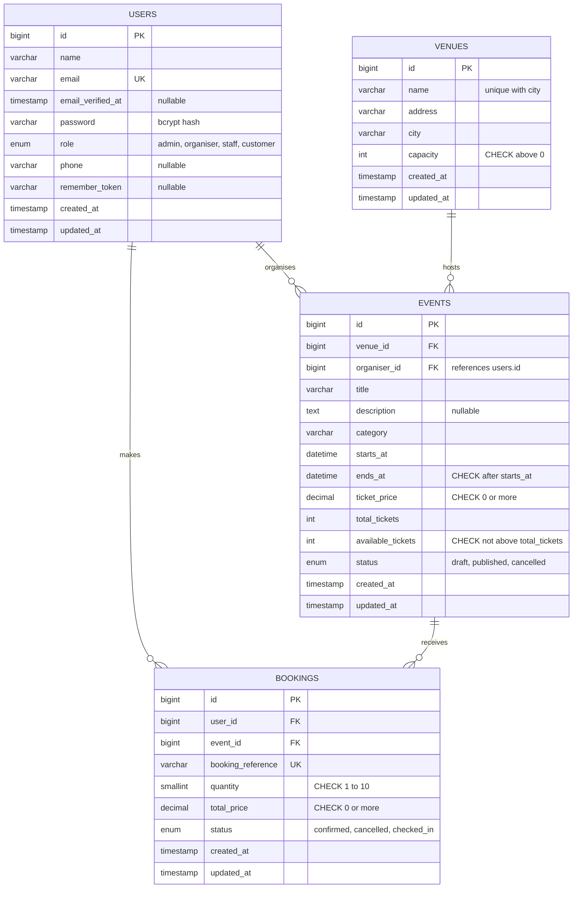

# Entity Relationship Diagram

```mermaid
erDiagram
    USERS ||--o{ EVENTS : "organises"
    USERS ||--o{ BOOKINGS : "makes"
    VENUES ||--o{ EVENTS : "hosts"
    EVENTS ||--o{ BOOKINGS : "receives"

    USERS {
        bigint id PK
        varchar name
        varchar email UK
        timestamp email_verified_at "nullable"
        varchar password "bcrypt hash"
        enum role "admin, organiser, staff, customer"
        varchar phone "nullable"
        varchar remember_token "nullable"
        timestamp created_at
        timestamp updated_at
    }

    VENUES {
        bigint id PK
        varchar name "unique with city"
        varchar address
        varchar city
        int capacity "CHECK above 0"
        timestamp created_at
        timestamp updated_at
    }

    EVENTS {
        bigint id PK
        bigint venue_id FK
        bigint organiser_id FK "references users.id"
        varchar title
        text description "nullable"
        varchar category
        datetime starts_at
        datetime ends_at "CHECK after starts_at"
        decimal ticket_price "CHECK 0 or more"
        int total_tickets
        int available_tickets "CHECK not above total_tickets"
        enum status "draft, published, cancelled"
        timestamp created_at
        timestamp updated_at
    }

    BOOKINGS {
        bigint id PK
        bigint user_id FK
        bigint event_id FK
        varchar booking_reference UK
        smallint quantity "CHECK 1 to 10"
        decimal total_price "CHECK 0 or more"
        enum status "confirmed, cancelled, checked_in"
        timestamp created_at
        timestamp updated_at
    }
```
